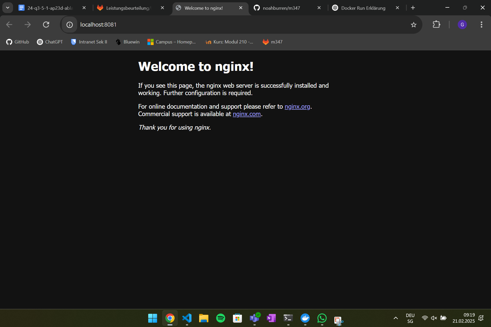
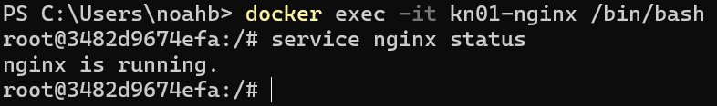
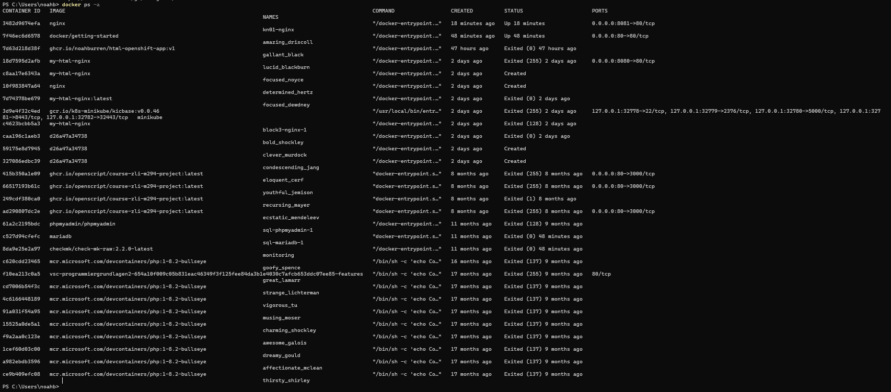
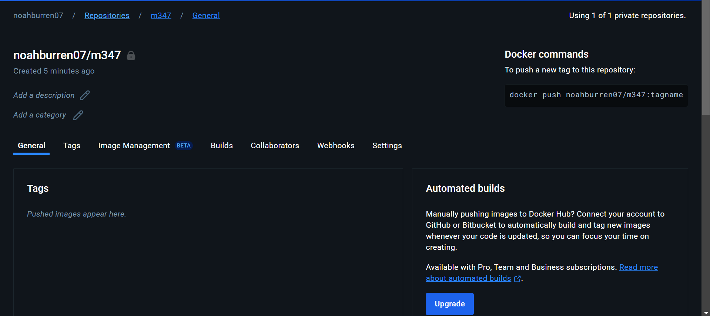
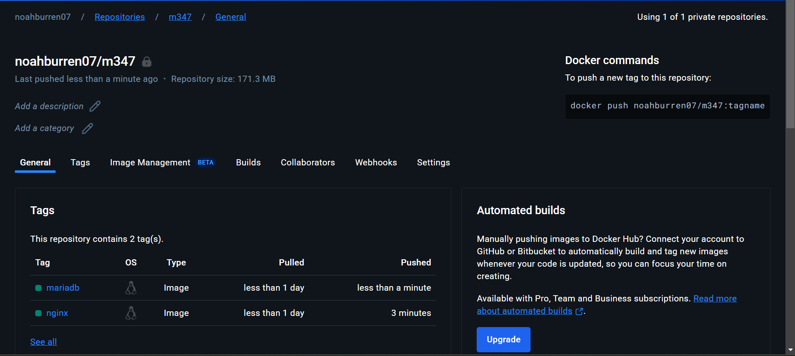

# A) Installation (20%)

## Screenshot der Webseite, nachdem Sie den ersten Container erstellt haben.

## Screenshot der Containers in Docker Desktop, der Ihren Container zeigt.

# B) Docker Command Line Interface (CLI) (50%)

## Befehle
``docker -v`` → Zeigt die aktuelle Version der Docker-Installation an.

``docker search ubuntu`` → Durchsucht Docker Hub nach Images, die mit "ubuntu" übereinstimmen.

``docker search nginx`` → Durchsucht Docker Hub nach Images, die mit "nginx" übereinstimmen.

`docker run` → Startet einen neuen Container

`-d` → Detached Mode (Container läuft im Hintergrund)

`-p 80:80` → Port-Mapping (Host-Port 80 wird an Container-Port 80 weitergeleitet)

`docker/getting-started` → Name des Images, das verwendet wird

``docker pull nginx`` → Lädt das nginx-Image von Docker Hub herunter, falls es lokal nicht vorhanden ist.

``docker create -p 8081:80 --name kn01-nginx nginx`` → Erstellt einen Container mit dem Namen kn01-nginx und verbindet Port 8081 auf dem Host mit Port 80 im Container.

``docker start kn01-nginx`` → Startet den zuvor erstellten Container kn01-nginx.

``docker exec -it kn01-nginx /bin/bash`` → Öffnet eine interaktive Shell in einem laufenden Container  

``service nginx status`` → Zeigt den aktuellen Status des Nginx-Dienstes im Container  

``exit`` → Beendet die Bash-Sitzung, Container bleibt aktiv  

``docker ps -a`` → Zeigt alle Container, auch gestoppte  

``docker stop kn01-nginx`` → Stoppt den Container `kn01-nginx`  

``docker rm $(docker ps -aq)`` → Entfernt alle Container  

``docker rmi nginx`` → Entfernt das `nginx`-Image  
``docker rmi docker/getting-started`` → Entfernt das `docker/getting-started`-Image  

``docker tag nginx:latest noahburren07/m347:nginx`` → Erstellt eine Kopie des Images mit neuem Namen und Tag  

``Tag`` → Eine Kennzeichnung für ein Image, um verschiedene Versionen zu unterscheiden  

``docker push noahburren07/m347:nginx`` → Lädt das Image ins eigene Docker Hub Repository hoch  

``docker pull mariadb:latest`` → Lädt das neueste MariaDB-Image herunter  

``docker tag mariadb:latest noahburren07/m347:mariadb`` → Erstellt eine Kopie des MariaDB-Images mit eigenem Tag  

``docker push noahburren07/m347:mariadb`` → Lädt das MariaDB-Image ins eigene Docker Hub Repository hoch  

## Nginx

## Container erstellen und starten mit docker run -it

``docker run -it --name my-nginx-interactive nginx``

Erklärung:
- Der Container wird interaktiv (-it) gestartet, wodurch eine Terminal-Sitzung mit ihm hergestellt wird.
- Falls das nginx-Image noch nicht vorhanden ist, wird es automatisch heruntergeladen.
- Der Container läuft im Vordergrund, und die Konsole bleibt mit ihm verbunden.
- Hier gibt es keine automatische Portweiterleitung; stattdessen wird eine interaktive Sitzung gestartet.
- Durch Eingabe von exit oder Ctrl + D kann die Sitzung beendet werden.

## Nginx Status

## Container Status

## Repository

## Repository mit Tags

