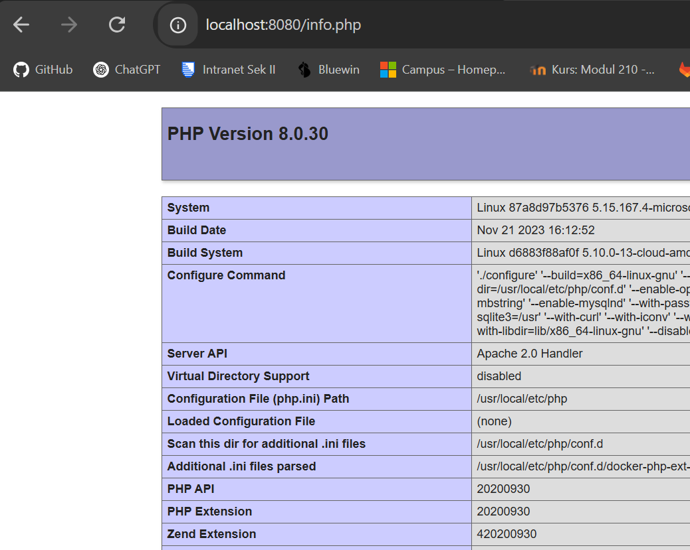

# A) Dockerfile I
## 1. Korrigiertes Dockerfile erstellen  

Erstelle eine Datei namens `Dockerfile` (ohne Dateiendung) mit folgendem Inhalt:  

```dockerfile
# Basis-Image von Nginx verwenden  
FROM nginx

# Arbeitsverzeichnis auf den Standard-Root für HTML-Dateien setzen  

# Kopiert die HTML-Datei in das Arbeitsverzeichnis  
COPY helloworld.html /usr/share/nginx/html/helloworld.html

# Öffnet Port 80 für eingehende Verbindungen  
EXPOSE 80

```
### Docker-Image bauen
``docker build -t noahburren07/m347:kn02a . ``
→ Erstellt ein neues Docker-Image mit dem Tag kn02a

### Image in eigenes Repository hochladen
``docker push noahburren07/m347:kn02a ``
→ Lädt das Image in das eigene Docker Hub Repository hoch

### Container mit dem neuen Image starten
``docker run -d -p 8082:80 --name kn02a-container noahburren07/m347:kn02a ``
→ Startet einen Container mit dem neuen Image

## Image KN02


## Hello.hml


---

# B) Dockerfile II

# **Docker-Setup für Datenbank und Webserver**  

## **1. Dockerfile für den Datenbank-Container (MariaDB)**  
Erstelle eine Datei `Dockerfile` im Ordner `kn02-db`:  

```dockerfile
# Basis-Image für MariaDB  
FROM mariadb:latest  

# Umgebungsvariablen für DB-Zugang setzen  
ENV MYSQL_ROOT_PASSWORD=root  
ENV MYSQL_DATABASE=mydb  

# Port 3306 für externe Zugriffe freigeben  
EXPOSE 3306  

# Docker-Setup für Datenbank und Webserver

## 1. Dockerfile für den Datenbank-Container (MariaDB)
Erstelle eine Datei `Dockerfile` im Ordner `kn02-db`:

```dockerfile
# Basis-Image für MariaDB  
FROM mariadb:latest  

# Umgebungsvariablen für DB-Zugang setzen  
ENV MYSQL_ROOT_PASSWORD=root  
ENV MYSQL_DATABASE=mydb  

# Port 3306 für externe Zugriffe freigeben  
EXPOSE 3306  
```

## 2. Docker-Build und -Run Befehle für den DB-Container
Baue das Image und starte den Container mit:

```powershell
docker build -t kn02b-db .
docker run -d --name kn02b-db -p 3306:3306 kn02b-db
```

## 3. Dockerfile für den Web-Container (PHP mit Apache)
Erstelle eine Datei `Dockerfile` im Ordner `kn02-web`:

```dockerfile
# Basis-Image mit Apache
FROM php:8.0-apache

# Benötigtes PHP-Modul installieren
RUN docker-php-ext-install mysqli

# Arbeitsverzeichnis setzen
WORKDIR /var/www/html

# Web-Dateien in den Container kopieren
COPY . /var/www/html/

# Port 80 für externe Zugriffe freigeben
EXPOSE 80
```

## 4. Docker-Build und -Run Befehle für den Web-Container
Baue das Image und starte den Container mit:

```powershell
docker build -t kn02b-web .
docker run -d --name kn02b-web -p 8080:80 --link kn02b-db:mysql kn02b-web
```

## 5. Angepasste PHP-Dateien
### `info.php`
```php
<?php
phpinfo();
?>
```

### `db.php`
```php
<?php
$servername = "mysql"; // Verweis auf den DB-Container
$username = "root";
$password = "root";
$database = "mydb";

// Verbindung zur Datenbank herstellen
$conn = new mysqli($servername, $username, $password, $database);

// Verbindung überprüfen
if ($conn->connect_error) {
    die("Verbindung fehlgeschlagen: " . $conn->connect_error);
}

echo "Erfolgreich mit der Datenbank verbunden.";
$conn->close();
?>
```

## 6. Verbindung zur Datenbank testen
### Per PowerShell:
```powershell
Test-NetConnection -ComputerName kn02b-db -Port 3306
```


## 7. Screenshots der PHP-Seiten
- `info.php`: Zeigt die PHP-Informationen

- `db.php`: Bestätigt die Verbindung zur MariaDB-Datenbank


