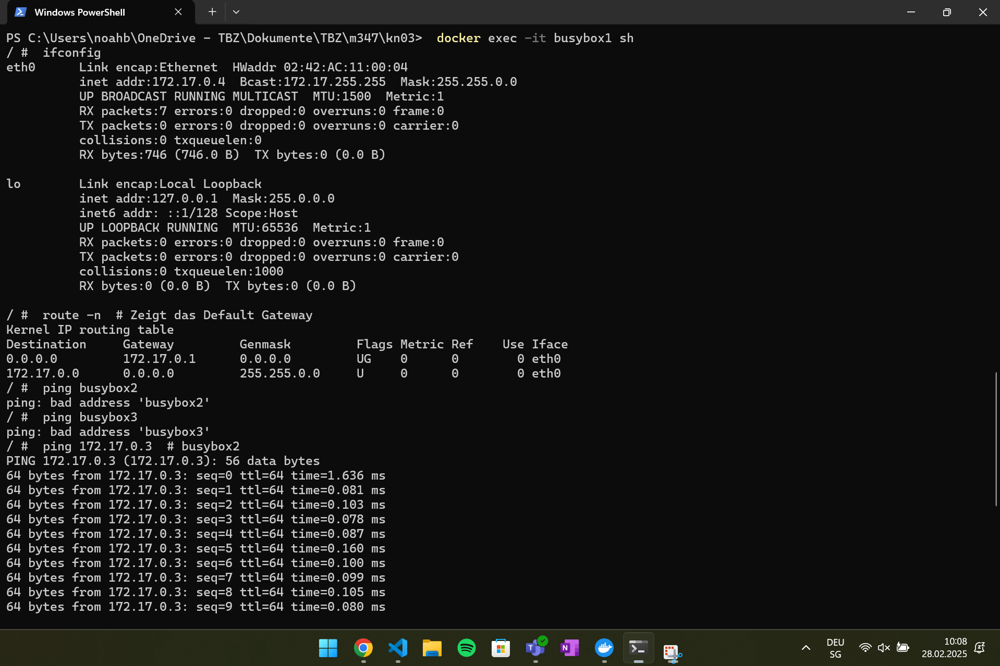
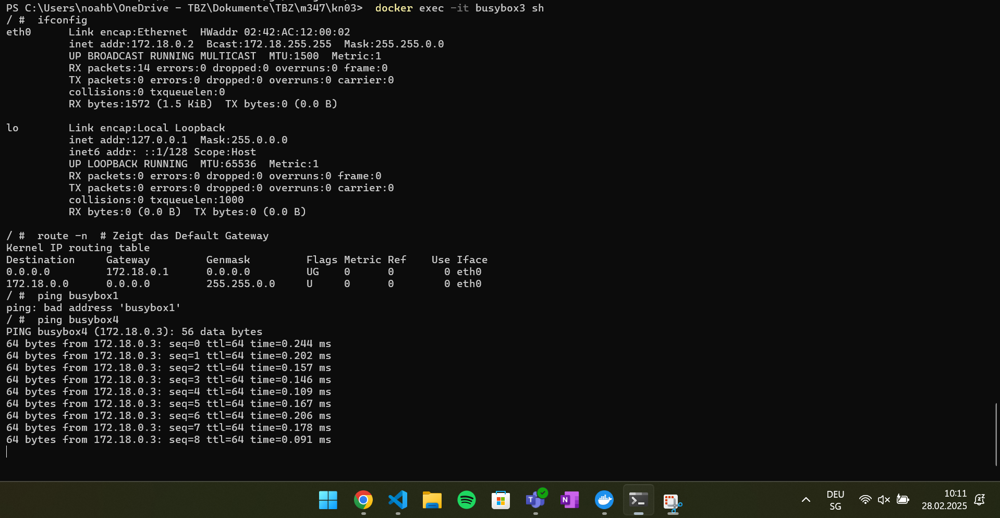

# **Netzwerkkonfiguration mit Docker und BusyBox**

## **1. Erstellung der Netzwerke und Container**

### **Erstellen des benutzerdefinierten Netzwerks `tbz`**
```bash
 docker network create --subnet=172.18.0.0/16 tbz
```

### **Erstellen und Starten der Container**
#### **Container im `default bridge` Netzwerk**
```bash
 docker run -dit --name busybox1 busybox sh
 docker run -dit --name busybox2 busybox sh
```

#### **Container im `tbz` Netzwerk**
```bash
 docker run -dit --net tbz --name busybox3 busybox sh
 docker run -dit --net tbz --name busybox4 busybox sh
```

---

## **2. Untersuchung der Netzwerkkonfiguration**

### **Ermitteln der IP-Adressen der Container**
```sh
$containers = @("busybox1", "busybox2", "busybox3", "busybox4")

foreach ($container in $containers) {
    $ip = docker inspect -f '{{range.NetworkSettings.Networks}}{{.IPAddress}}{{end}}' $container
    Write-Host "${container}: ${ip}"
}

```

**Ausgabe:**
- `busybox1`: 172.17.0.4
- ``busybox2``: 172.17.0.5
- ``busybox3``: 172.18.0.2
- ``busybox4``: 172.18.0.3

### **Test der Netzwerkerreichbarkeit**

#### **Interaktive Session auf `busybox1`**
```bash
 docker exec -it busybox1 sh
```
**Befehle in der Session:**
```bash
 ifconfig
 route -n  # Zeigt das Default Gateway
 ping busybox2
 ping busybox3
 ping 172.17.0.3  # busybox2
 ping 172.18.0.2  # busybox3
```


#### **Interaktive Session auf `busybox3`**
```bash
 docker exec -it busybox3 sh
```
**Befehle in der Session:**
```bash
 ifconfig
 route -n  # Zeigt das Default Gateway
 ping busybox1
 ping busybox4
 ping 172.17.0.2  # busybox1
 ping 172.18.0.3  # busybox4
```


---

## **3. Analyse der Ergebnisse**

### **Gemeinsamkeiten und Unterschiede**
- Container `busybox1` und `busybox2` teilen sich das gleiche Default-Gateway (`172.17.0.1`), da sie im `default bridge` Netzwerk sind.
- Container `busybox3` und `busybox4` haben ein anderes Default-Gateway (`172.18.0.1`), da sie im `tbz`-Netzwerk sind.
- `busybox1` kann `busybox2` pingen, aber nicht `busybox3` oder `busybox4`, da sie sich in getrennten Netzwerken befinden.
- `busybox3` kann `busybox4` pingen, aber nicht `busybox1` oder `busybox2`, aus demselben Grund.

### **Schlussfolgerung**
- Container innerhalb desselben Netzwerks können direkt miteinander kommunizieren.
- Container in separaten Netzwerken sind voneinander isoliert und benötigen eine Brücke oder manuelle Netzwerkverbindung, um miteinander zu kommunizieren.

---

## **4. Vergleich mit KN02 (Web- und DB-Container)**

### **In welchem Netzwerk befanden sich die Container?**
- Beide Container (`kn02b-db` und `kn02b-web`) befanden sich im `default bridge` Netzwerk.

### **Warum konnten die Container miteinander kommunizieren?**
- Im `default bridge` Netzwerk können Container über ihre Namen kommunizieren, solange sie mit `--link` verbunden oder in demselben Netzwerk definiert sind.
- `kn02b-web` konnte auf `kn02b-db` zugreifen, indem er den Container-Namen oder die IP-Adresse nutzte.

---


