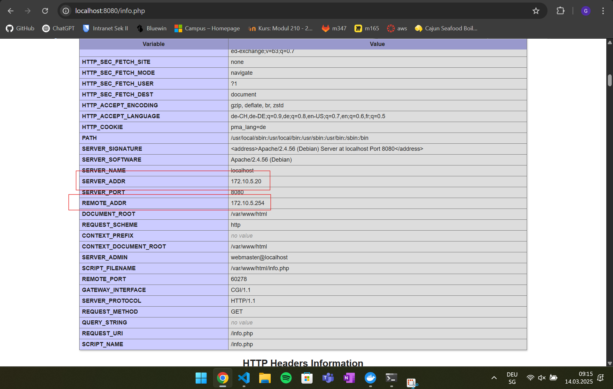
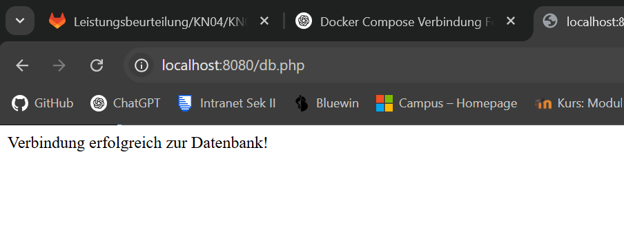
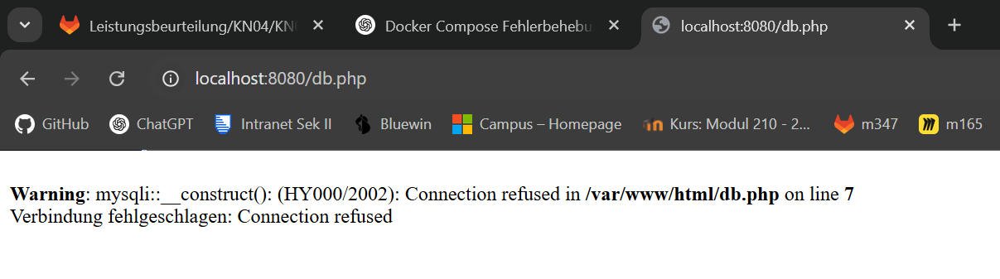
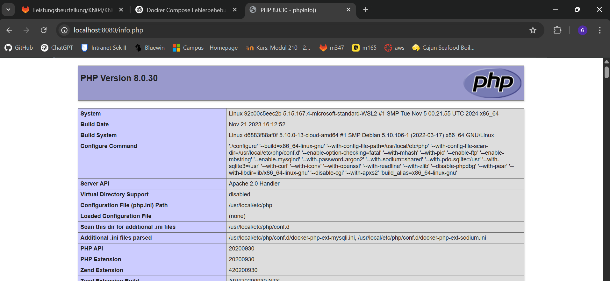

# A) Docker Compose: Lokal (60%)

## Teil a) Verwendung von Original Images

### Die Liste der Befehle, die docker compose up ausführt:

``docker compose build`` – Baut das Webserver-Image aus dem Dockerfile.
``docker compose create`` – Erstellt Container für die definierten Services.
``docker compose start`` – Startet die Container.
``docker compose attach`` – Verbindet die Logs der Container mit der Konsole.

### Screenshot der Seite info.php. Scrollen Sie dabei zuerst runter bis die Felder REMOTE_ADDR und SERVER_ADDR sichtbar sind

### Screenshot der Seite db.php. Sie zeigen, dass beide Images im gleichen Netzwerk sind.

## Teil b) Verwendung Ihrer eigenen Images

### Screenshots der beiden Seiten
#### Error

#### Info

### Erklärung wieso der Fehler auftritt

Beim Aufruf der ``db.php``-Datei kann es zu einem Fehler kommen, wenn der Webserver schneller bereit ist als die MariaDB-Datenbank. In meinem Fall trat kein Fehler auf, weil die Datenbank bereits vollständig bereit war, als ``db.php`` ausgeführt wurde.

Typischerweise würde man eine Fehlermeldung wie Connection refused oder Access denied sehen, wenn z. B.:

- die DB noch nicht bereit ist,
- die Umgebungsvariablen falsch gesetzt sind,
- oder der Hostname im Netzwerk nicht erreichbar ist.
Um das generell zu vermeiden, könnte man in db.php einen Retry-Mechanismus einbauen, der die Verbindung mehrfach versucht.
Kurz danach funktioniert die Verbindung aber.