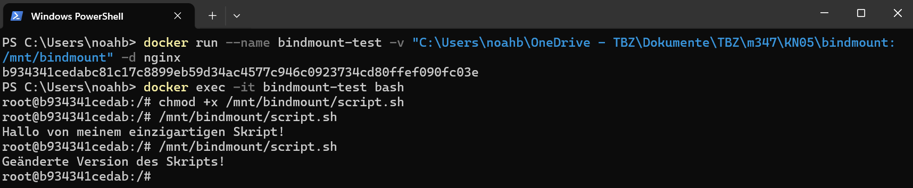
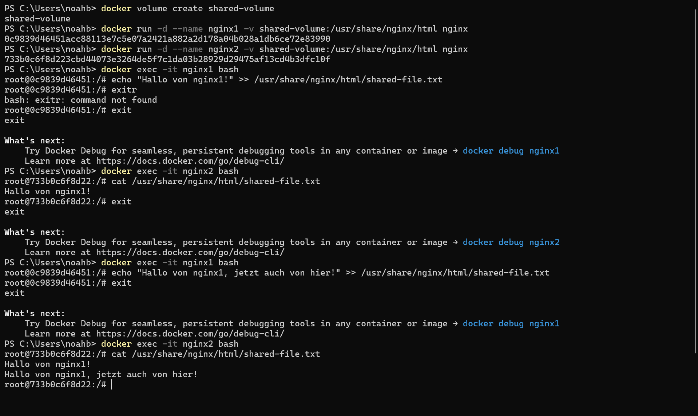
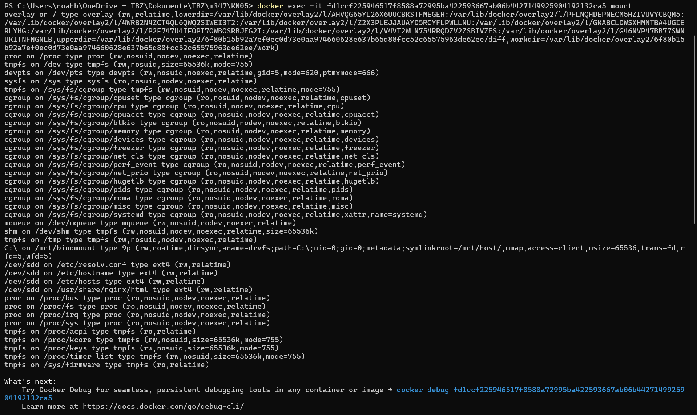
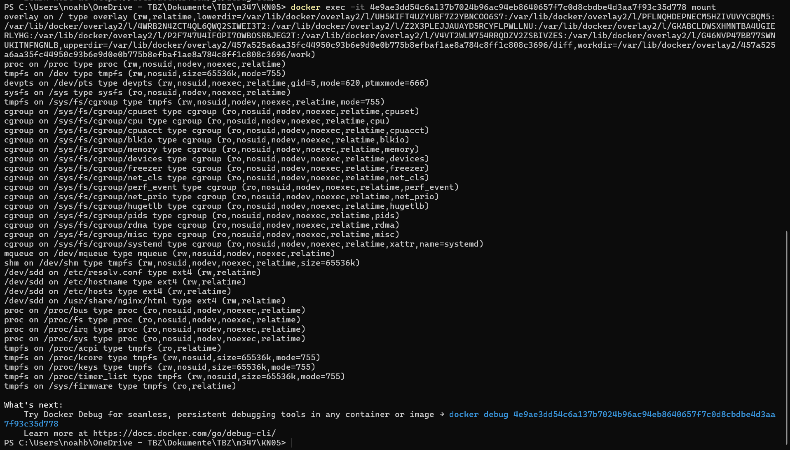

# A) Bind mounts (40%)
## Liste Der Befehle:
### Bind Mount-Verzeichniss Erstellen
```bash
 mkdir "C:\Users\noahb\OneDrive - TBZ\Dokumente\TBZ\m347\KN05\bindmount"
```

### Bash-Skript Erstellen
```bash
#!/bin/bash
echo "Hallo von meinem einzigartigen Skript!"
```

### Containers mit Bind Mount Starten

```bash
docker run --name bindmount-test -v "C:\Users\noahb\OneDrive - TBZ\Dokumente\TBZ\m347\KN05\bindmount:/mnt/bindmount" -d nginx
```

### Zugriff auf den Container und Ausführen des Skripts

```bash
docker exec -it bindmount-test bash
chmod +x /mnt/bindmount/script.sh
/mnt/bindmount/script.sh

```
#### Ausgabe:
```bash
Hallo von meinem einzigartigen Skript!
```

### Ändern des Skripts auf dem Host-System

```bash
#!/bin/bash
echo "Geänderte Version des Skripts!"
```

### Erneutes Ausführen im Container

```bash
/mnt/bindmount/script.sh
```

#### Neue Ausgabe:

```bash
Geänderte Version des Skripts!

```

### Bash Screenshot



## B) Volumes (30%)

### Named Volume erstellen

```bash
docker volume create shared-volume
```

### Container mit dem Named Volume starten

```bash
docker run -d --name nginx1 -v shared-volume:/usr/share/nginx/html nginx
docker run -d --name nginx2 -v shared-volume:/usr/share/nginx/html nginx
```

### In den ersten Container gehen und Datei schreiben

```bash
docker exec -it nginx1 bash
echo "Hallo von nginx1!" >> /usr/share/nginx/html/shared-file.txt
```

### In den zweiten Container gehen und Datei schreiben

```bash
docker exec -it nginx2 bash
cat /usr/share/nginx/html/shared-file.txt
```

### Zurück zum ersten Container gehen und die Datei ändern

```bash
docker exec -it nginx1 bash
echo "Hallo von nginx1, jetzt auch von hier!" >> /usr/share/nginx/html/shared-file.txt
```

### Im zweiten Container erneut die Datei lesen

```bash
docker exec -it nginx2 bash
cat /usr/share/nginx/html/shared-file.txt
```

### Bash Screenshot



# C) Speicher mit docker compose (30%)

## Mount 1

## Mount 2

