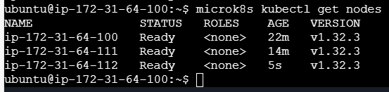
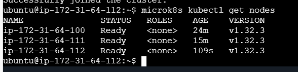
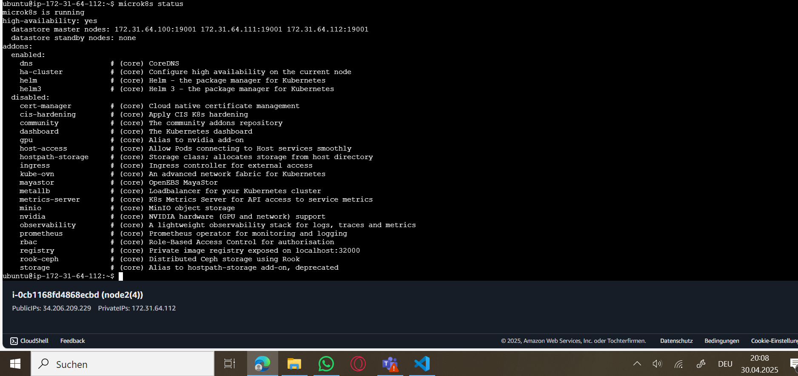
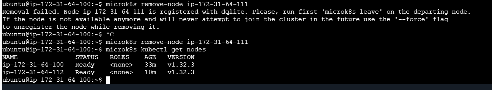
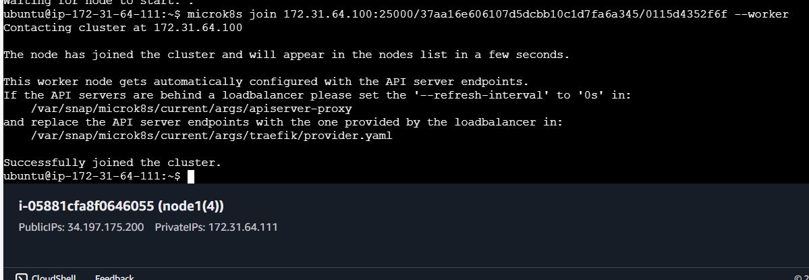
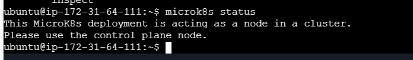
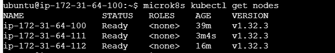
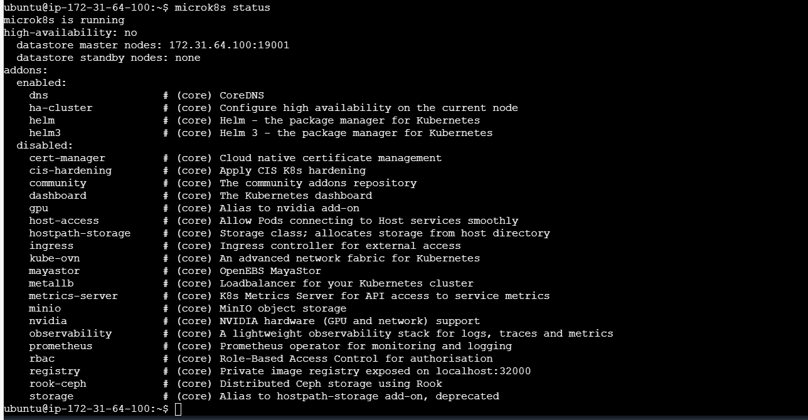

# A) Installation (50%)

# B) Verständnis für Cluster (50%)

## Status

### high-availability: yes:

Diese Zeile zeigt an, dass dein Cluster für hohe Verfügbarkeit (High Availability) konfiguriert ist.

### datastore master nodes: 172.31.64.100:19001 172.31.64.111:19001 172.31.64.112:19001:
Diese Zeile listet die IP-Adressen der Master-Nodes im Cluster auf, die für die Verwaltung des Datastore zuständig sind.

### datastore standby nodes: none:

Diese Zeile zeigt, dass es keine Standby-Nodes für den Datastore gibt.

## Remove

.PNG)

## Status as Worker

Der aktueller Server ist nicht der Master-Node, sondern ein Worker-Node im MicroK8s-Cluster. Deshalb darf man von hier aus keine Cluster-weiten Kommandos wie ``microk8s status`` ausführen.

Der aktueller Server ist nicht der Master-Node, sondern ein Worker-Node im MicroK8s-Cluster. Deshalb darf man von hier aus keine Cluster-weiten Kommandos wie ``kubectl get nodes`` ausführen.

## Status on Master

